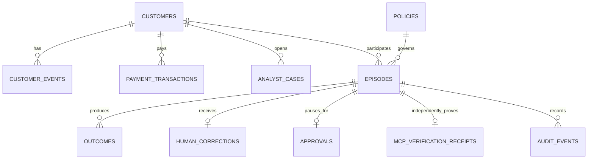

# Data model

> Status: Current
>
> Audience: Backend, data, operations, and security engineers
>
> Owner: Reliability Memory data maintainers
>
> Last reviewed: 2026-08-16

CockroachDB is authoritative for operational facts, issue evidence, semantic memory, policy history, review state, and audit evidence. Numbered migrations are applied in ascending order.

## Relationships

## Table ownership

| Object                      | Purpose                                                                   | Write owner                | Important constraints                         |
| --------------------------- | ------------------------------------------------------------------------- | -------------------------- | --------------------------------------------- |
| `customers`                 | Account, region, contract, and metadata                                   | Seed/operations            | Stable customer ID and bounded enums          |
| `customer_events`           | Order, delivery, service, device, and account timeline                    | Seed/integration           | Customer foreign key and time index           |
| `payment_transactions`      | Payment truth for payment-related adapters                                | Payment integration        | Positive amount, state enum, matching indexes |
| `analyst_cases`             | Queue record plus `evidence_bundle JSONB`                                 | Seed/operations            | Priority, expected permission, task index     |
| `policies`                  | Versioned deterministic rule documents                                    | Policy release process     | Unique task and version                       |
| `episodes`                  | Context, proposal, permission, action state, outcome state, and embedding | Agent runtime              | Unique idempotency key and bounded enums      |
| `outcomes`                  | Immediate and delayed independent observations                            | Verifier/outcome ingestion | Episode and outcome-type uniqueness           |
| `human_corrections`         | Resolution, reason, reusable lesson, and embedding                        | Human review               | At most one correction per episode            |
| `approvals`                 | Prefilled review packet and resolution state                              | Graph review               | At most one approval per episode              |
| `mcp_verification_receipts` | Cluster-scoped persisted-episode and vector-memory proof                  | Managed MCP verifier       | At most one hashed receipt per episode        |
| `audit_events`              | Append-only actor and event evidence                                      | Runtime                    | Episode/time index                            |
| `skill_reliability`         | Verified evidence aggregated by agent and task                            | Database view              | Pending records excluded                      |
| LangGraph checkpoint tables | Durable graph state and interrupt payloads                                | `CockroachDBSaver`         | Managed by checkpointer                       |

## Evidence bundle schema

Migration `009_customer_resolution_evidence.sql` adds the JSON bundle used by both policy and UI. Its stable top-level fields are:

- `issue_type` and `evidence_required`;
- `customer_goal` and `business_guardrail`;
- `evidence_sources[]` with key, label, status, summary, and facts;
- `resolution_options[]` with action, bounded amount, label, customer-value components, company cost, goal fit, eligibility, permission floor, safety flag, reason, and lesson;
- `resolution_constraints` with the case cost limit, delegated cost limit, minimum goal fit, default permission floor, and safety boundary.

JSON keeps heterogeneous source facts together while `task_type`, priority, customer, and timestamps remain indexed relational columns. Policy first checks that `issue_type` matches the case and that every required key has a completed source.

The repository does not store a preferred option. The runtime derives it from the current `resolution_options` through `resolution_selector.py`, returns the formula and evaluated candidates in `ResolutionEvidence`, and then applies permission policy as a separate trust boundary.

## Semantic retrieval

Episodes and corrections store normalized `VECTOR(1024)` embeddings. Each record also stores the embedding model, input-contract version, and embedding timestamp. Production uses Amazon Titan Text Embeddings V2 in AWS; retrieval filters on the exact model identifier so vectors from different semantic spaces are never compared.

Vector indexes use `task_type` as a prefix. The query filters to the same task and model, ranks with indexed L2 distance, and reports cosine similarity. Retrieval therefore finds comparable verified situations without mixing device safety, delivery, damage, identity, warranty, or incompatible model semantics. Similarity retrieves evidence; it never grants permission. A resume-safe deployment step upgrades deterministic seed vectors to Titan before the public runtime starts using them.

## Transaction boundaries

1. Read case, evidence bundle, entity history, policy, and verified experience outside a write transaction.
2. Insert one episode, approval state when needed, audit data, embedding, and idempotency key in a short transaction.
3. Read the committed episode and vector neighbors through Managed MCP, then persist its receipt and effective permission.
4. Contract a failed required proof to human review before any external operation.
5. Execute an external action outside the database transaction.
6. Persist immutable action facts and independently verified outcome in a second short transaction.
7. Retry the complete database operation on SQLSTATE `40001`.
8. Reconcile SQLSTATE `40003` by idempotency key before any external replay.

Pending episodes do not improve reliability. A correction may attach only to a pending supervised episode; an identical retry returns the existing record and a conflicting rewrite fails.

## Migration policy

- Never modify an applied production migration; add the next numbered file.
- Record every applied filename and SHA-256 checksum in `reliability_schema_migrations`; refuse changed or unknown history.
- Baseline verified pre-ledger installations through migration 009 using multiple schema and policy sentinels.
- Make migrations retry-safe with supported idempotent DDL or upsert patterns.
- Update this document and repository tests when ownership or relationships change.
- Add least-privilege runtime grants with each new object.
- Use expand, migrate, and contract for incompatible data changes.

## Data handling

All bundled records are synthetic. Credentials are runtime inputs excluded from source. A production evidence receipt can contain customer operational context, so access, retention, deletion, and regional rules must be defined before real use.
