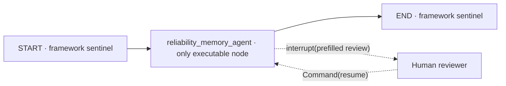
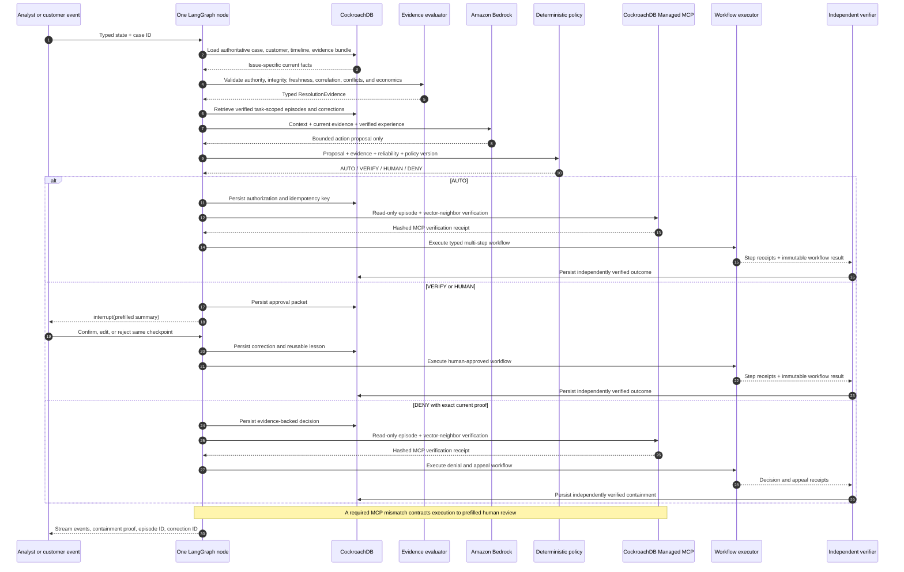
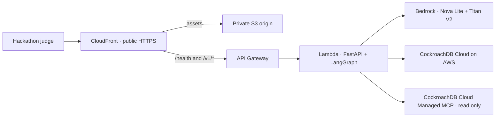

# System design

> Status: Current
>
> Audience: Software architects, backend engineers, data engineers, and reviewers
>
> Owner: Reliability Memory maintainers
>
> Last reviewed: 2026-08-16

Reliability Memory is a closed resolution-operations evidence loop for consumer and enterprise cases. Current facts establish eligibility, verified outcomes establish earned reliability, and deterministic policy turns both into bounded permission.

Related contracts: [API contract](./API_CONTRACT.md), [data model](./DATA_MODEL.md), [threat model](../security/THREAT_MODEL.md), and [decision records](./decisions/).

## One-node graph contract



`AgentGraphState` is a `TypedDict` containing the thread ID, idempotency key, serialized case, status, API result, review summary, human resolution, and correction ID. The single node owns the complete business loop. This keeps the “one node” claim literal while LangGraph supplies typed state, event streaming, checkpoints, and interrupt/resume.

## Runtime sequence



## Why evidence differs by issue

A generic “history + amount” rule cannot resolve real operational problems. Each catalog task declares a source contract:

| Issue family            | Evidence examples                                                                   | Candidate actions                           |
| ----------------------- | ----------------------------------------------------------------------------------- | ------------------------------------------- |
| Damage                  | order, photo or installer inspection, product return rate, logistics, economics     | keep offer, exchange, replacement, refund   |
| Product failure         | serial-linked diagnostics, warranty, firmware, batch quality, parts or inventory    | guided troubleshooting, repair, replacement |
| Delivery                | carrier GPS/photo/signature, address and mailroom records, claim history, inventory | trace, reship, refund, carrier recovery     |
| Fulfillment             | order line, barcode, package weight, bill of materials, warehouse scan              | exchange, ship missing part, partial reship |
| Safety                  | symptom, serial, recall and incident database, safety protocol                      | safety escalation only                      |
| Seller integrity        | listing, seller history, authentication, related complaints                         | seller investigation, refund under review   |
| Identity or eligibility | serial ownership, account proof, order identity, warranty dates                     | approve bounded plan or deny with appeal    |
| Service recovery        | delivery promise, root cause, prior credits, retention economics                    | apology credit or alternative remedy        |
| Release recovery        | deployment gates, signed artifact, schema compatibility, health telemetry, runbook  | safe rollback and verified recovery         |
| Data and capacity       | database telemetry, query and lock analysis, change history, bounded capacity plan  | temporary capacity or isolated restore      |
| Identity and security   | authorization trace, ownership, audit, forensics, blast radius, response plan       | least privilege or human-owned containment  |
| Traffic and quota       | request traces, load simulation, capacity, budget, abuse posture, expiry            | retry stabilization or bounded quota change |

The evaluator produces `ResolutionEvidence` with grade `EXACT`, `REVIEW`, or `BLOCKED`; completed and missing sources; current positive facts; blockers; recommended action and amount; customer value; company cost; cost cap; safety flag; permission floor; alternatives; rationale; and reusable lesson.

## Strict evidence admissibility

Every required record must pass six independent checks before it can satisfy the case contract:

1. **Authority:** the source declares an admitted system-of-record, independent verifier, or customer-evidence authority.
2. **Provenance:** source system and immutable record ID are present.
3. **Integrity:** the runtime recomputes the SHA-256 payload digest and compares it with the stored digest.
4. **Freshness:** observation time is not in the future and is inside the source-specific maximum age at the decision snapshot.
5. **Entity correlation:** case ID, customer ID, and task type match the authoritative case.
6. **Conflict and uniqueness:** conflict metadata is present and empty, and no evidence key appears more than once.

Any failed check yields `BLOCKED` and prevents automatic execution. Warning-grade but otherwise admissible evidence yields `REVIEW`; it can support a prefilled supervised resolution but not autonomy. Only warning-free, complete evidence yields `EXACT`.

## Decision order

Policy `customer-resolution-v5.0` is intentionally evidence-first:

1. Validate proposal action and amount invariants.
2. Route abuse signals to neutral human review.
3. Require the proposal to match the evidence-derived plan.
4. Deny proven identity or eligibility conflicts with an appeal path.
5. Stop when issue-specific evidence is incomplete.
6. Downgrade review-grade evidence before evaluating autonomy.
7. Force safety-critical and explicit human-boundary cases to review.
8. Preserve customer choice through `VERIFY` floors.
9. Apply scenario-specific company-cost caps.
10. Allow `AUTO` only with exact evidence, low risk, at least 100 verified comparable outcomes, and at least 98% reliability.

Policy v4.9 is retained only for the judge experiment. It represents the weak amount-first baseline: a low amount and broad historical score can authorize without proving the issue-specific facts. The same packet demonstrates why v5.0 is safer and more useful.

## Customer satisfaction and company economics

The runtime does not maximize refund size or minimize cost alone. Source systems supply feasible options with four explicit measures:

- `customer_value`: usefulness delivered to the customer;
- `company_cost`: expected company exposure for that action;
- `goal_fit`: how completely the option satisfies the stated customer outcome;
- `value_components`: the auditable inputs that sum to customer value.

`resolution_selector.py` rejects ineligible or over-limit options and calculates `goal_fit × customer_value ÷ company_cost` for every remaining candidate. It does not read a stored recommendation. For Srinivas's functional but dented espresso machine, $95 is explicitly composed from a $60 adjustment plus $35 expected two-year warranty value. The keep offer scores highest because it directly fits his request to keep the working machine, while replacement and return add delay and reverse-logistics effort. Policy still returns `VERIFY`, so Srinivas chooses whether to accept it. A high-value cracked television instead stays `HUMAN` even though freight telemetry proves the claim.

## Human review packet

LangGraph interrupts only after the investigation is complete. The summary contains the request, current facts, source status, proposal, policy rule and reasons, selected and alternative resolutions, economics, nearest verified episodes, Managed MCP status, suggested reason, lesson, and exact workflow plan. The reviewer confirms or edits the packet and resumes the same thread. Approval executes the reviewed workflow, independently verifies it, and returns step receipts. This reduces analyst work without hiding either the basis or downstream effects of the recommendation.

## Managed MCP verification boundary

Direct `psycopg` access remains the write path because authorization, idempotency, outcome, and checkpoint records require short atomic transactions. Managed MCP is a second, read-only observation path. After the decision record commits and before any autonomous side effect, the runtime discovers the server's `select_query` schema, reads the exact episode through the cluster-scoped MCP connection, and replays a task-scoped vector-neighbor query from the stored embedding.

The proof passes only when the episode ID, decision, policy version, and direct-vector result agree. Its public fields are canonicalized into a SHA-256 receipt and persisted in `mcp_verification_receipts`. In AWS, verification is mandatory: transport failure, record mismatch, or vector mismatch changes the effective permission to `HUMAN`, updates the episode, emits `policy.contracted`, and creates the same prefilled LangGraph interrupt used by other supervised cases. No provider action runs first.

## Workflow execution contract

`build_workflow_plan()` compiles the approved action and issue context into typed operations before any side effect. A replacement plan uses inventory, fulfillment, quality, and communications; refunds use payment and finance controls; safety incidents use product-safety, recovery, quality, and incident-management operations. Every plan includes a compensation instruction.

The current provider adapter simulates external payment, order, carrier, warranty, safety, infrastructure, identity, data, and communications operations with deterministic idempotent receipts. It does not call real provider accounts. Production adapters replace each simulated operation without changing graph, policy, review, event, or audit semantics. The workflow ID, action ID, step references, and artifacts are stable for the same idempotency key.

## Containment proof

`ContainmentProof` is created before persistence and finalized after independent verification. It binds the admitted source record IDs and evidence grade to the root-cause statement, policy rule, autonomy level, workflow ID, completed-operation count, verification status, customer value, company cost, estimated human time avoided, and seven-day reopen monitor. The UI renders this API object directly, and the repository includes it in the evidence receipt.

## Memory and correction replay

| Memory        | Exact retrieval                          | Semantic retrieval            | Reliability impact     |
| ------------- | ---------------------------------------- | ----------------------------- | ---------------------- |
| Entity        | customer and operational timeline        | recurring context summary     | context only           |
| Case evidence | current issue bundle                     | none                          | eligibility            |
| Episode       | task, proposal, permission, action       | similar verified situations   | after verification     |
| Outcome       | immediate and delayed consequences       | comparable downstream results | strong                 |
| Correction    | human resolution and reason              | reusable lesson               | override plus lesson   |
| Policy        | version and validity                     | none                          | deterministic boundary |
| Audit         | actor, rule, latency, provider reference | none                          | observability          |

The warranty-grace demonstration starts with a human-reviewed case. A reviewer records the narrow lesson that a verified known defect within 14 days after warranty expiry may receive a repair. A later comparable case retrieves that correction, changes the proposal to `warranty_repair`, emits `correction.replayed`, and remains `VERIFY` until enough corrected outcomes earn narrower autonomy.

## Reliability experiments

| Experiment              | Mechanism                                                   | Proof                                                               |
| ----------------------- | ----------------------------------------------------------- | ------------------------------------------------------------------- |
| Memory ablation         | Run the same case with and without verified history         | reliability and permission delta                                    |
| Correction replay       | Persist and retrieve the warranty-grace lesson              | changed future proposal plus correction ID                          |
| Evidence receipt        | Canonical episode record from the repository                | visible/downloadable JSON and SHA-256                               |
| Retry safety            | Submit one idempotency key twice                            | same episode and one provider reference                             |
| Reliability envelope    | Evaluate representative exact contexts                      | task, contract, evidence, cost, and permission                      |
| Delayed outcome         | Attach a later adverse consequence                          | before/after task reliability                                       |
| Policy comparison       | Evaluate one packet under v4.9 and v5.0                     | amount-first versus evidence-first result                           |
| Decision counterfactual | Apply minimal deltas to copied typed inputs and re-run v5.0 | validated path to `AUTO` or explicit hard boundary                  |
| Evidence fault lab      | Corrupt a digest, expire a record, or break correlation     | live `EXACT` → `BLOCKED` permission contraction with no side effect |
| Impact summary          | Join task outcome counts with selected case economics       | customer value and cost versus refund-first baseline                |
| Autonomy register       | Hash-chain dated context decisions                          | detectable changes to the current authority boundary                |

## AWS judge path



The browser uses one public CloudFront origin and requires no judge credentials. CloudFront never caches API routes. Lambda compiles the graph with `CockroachDBSaver` from `langchain-cockroachdb`; checkpoint tables preserve paused reviews across cold starts. This is separate from the distributed-vector memory index, so CockroachDB provides durable graph state, task-scoped experience retrieval, and an independently authenticated read-only verification path. The local adapter uses the same graph contract with deterministic proposal and repository implementations.

## Transaction and resilience rules

1. Retrieve and reason outside write transactions.
2. Persist authorization, embedding, audit data, and idempotency key atomically.
3. Verify the committed episode and vector evidence through cluster-scoped, read-only Managed MCP.
4. Contract the action to human review if the required proof fails.
5. Call an external provider outside the database transaction.
6. Persist execution and verified outcome in a second short transaction.
7. Retry a full database operation on `40001` with backoff and jitter.
8. Reconcile ambiguous `40003` results by idempotency key before provider replay.
9. Store a correction only against a pending supervised episode.

Pending results never improve reliability. Random UUID keys distribute writes, task-prefixed vector indexes prevent semantic cross-contamination, current reads authorize actions, and bounded Lambda concurrency protects CockroachDB and Bedrock.

## Extension boundary

The reliability core uses four domain hooks:

```python
build_current_evidence(case)
propose_action(evidence, verified_experience)
build_workflow_plan(case, authorized_action)
execute_workflow(plan, idempotency_key)
verify_outcome(case, execution)
```

A production integration can replace simulated logistics, warranty, credit, or support adapters without changing the graph, memory, policy, review, or audit contracts.
